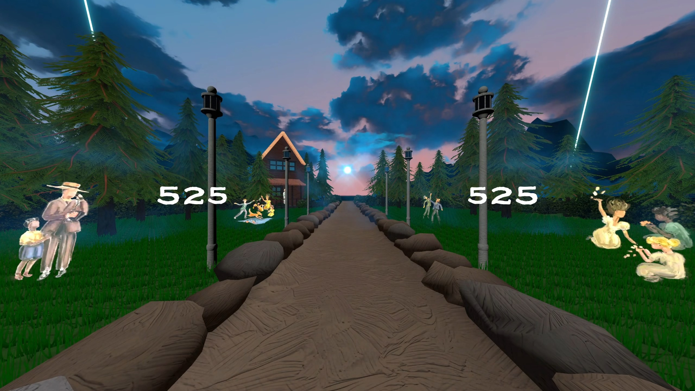
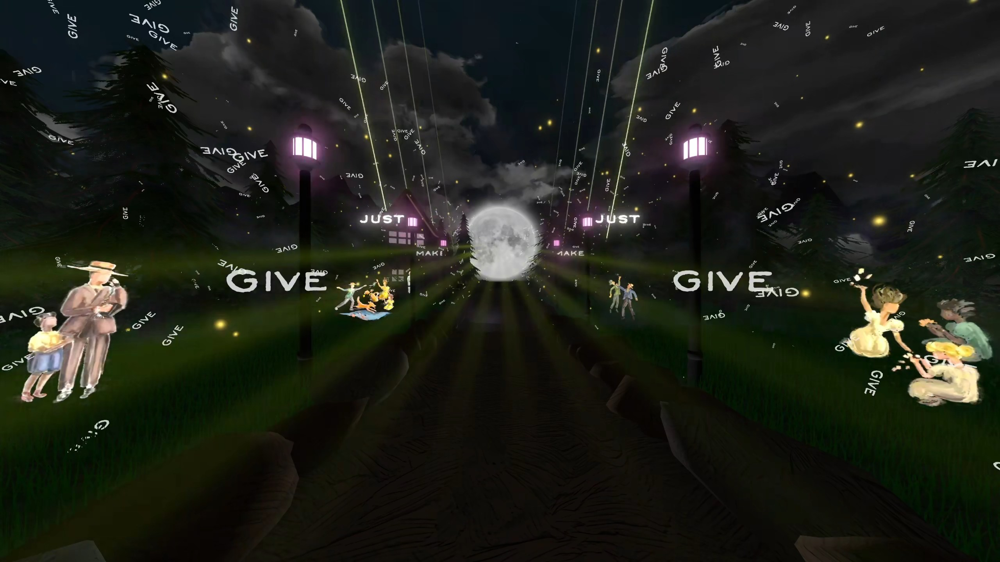

# The Big Goodbye - Vivify Beat Saber Custom Map

This is the repository for my custom Beat Saber map for "The Big Goodbye" by AJR, from their EP "What No One's Thinking". This map makes use of the Chroma, Noodle Extensions, and Vivify mods to create a fully custom environment.

BeatSaver link to map: https://beatsaver.com/maps/4c036

The mapping and Vivify environment are done by [me](https://github.com/Lekrkoekj), with lighting by [BanditByTheStreet](https://beatsaver.com/profile/username/banditbythestreet) and a guest Expert difficulty by [Scorefam](https://beatsaver.com/profile/username/scorefam).

Watch a gameplay preview of the map here (Expert+ difficulty): https://youtu.be/rdc5rO03nkM

Watch a preview of the lightshow with the environment here: https://youtu.be/9Fa2vv5zFrU

This repository contains all the mapping files, ReMapper script, and full Unity project.

Assets from the following sources are included in this project:
- [VivifyTemplate by Swifter](https://github.com/Swifter1243/VivifyTemplate)
- [UnityAnimationWindow by Swifter](github.com/Swifter1243/UnityAnimationWindow)
- [What No One's Thinking cover art](https://www.instagram.com/p/DL-kMWMpEsF/)
- [Bush models](https://www.fab.com/listings/56107089-69f1-4d88-b54a-9a75b1ec0964)
- [Rock models](https://www.fab.com/listings/055e31fb-d30e-44d8-aa4f-645206300887)
- [Tree models](https://sketchfab.com/3d-models/pine-tree-game-ready-dc3fbd9205cf4027a4455d1f415e0478)